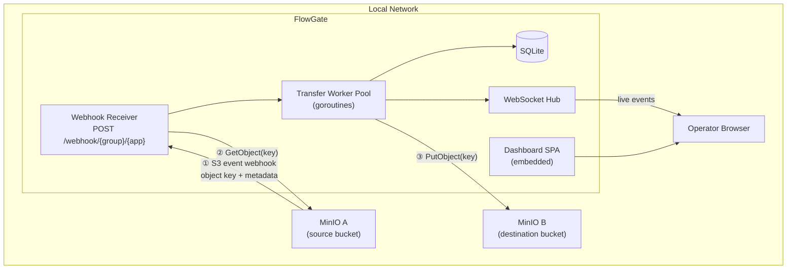
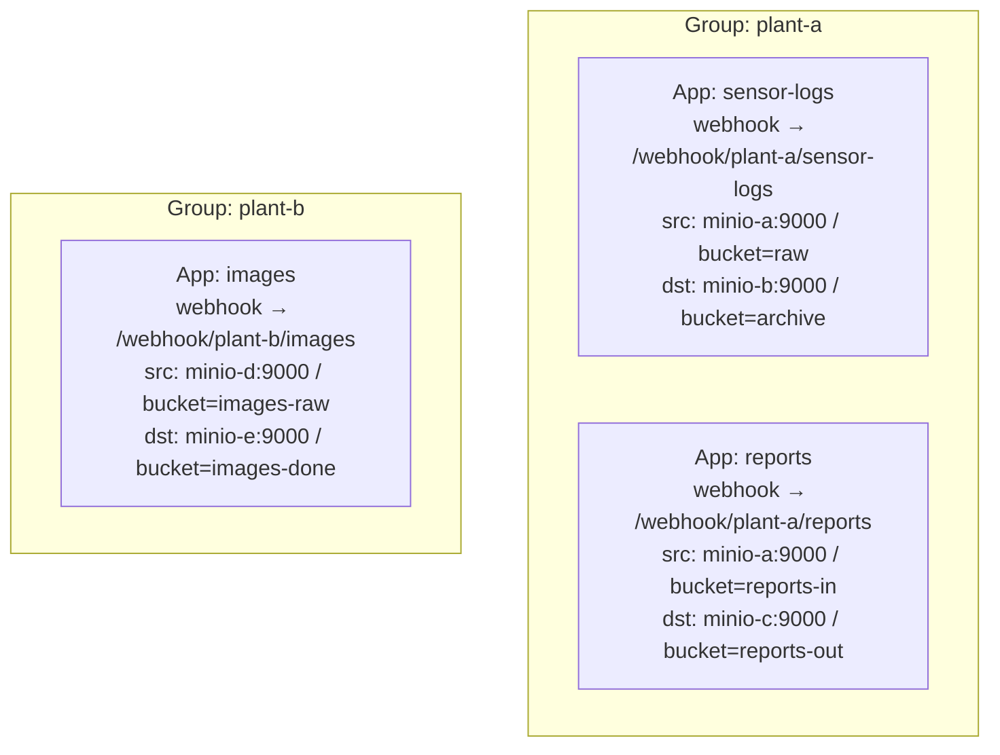
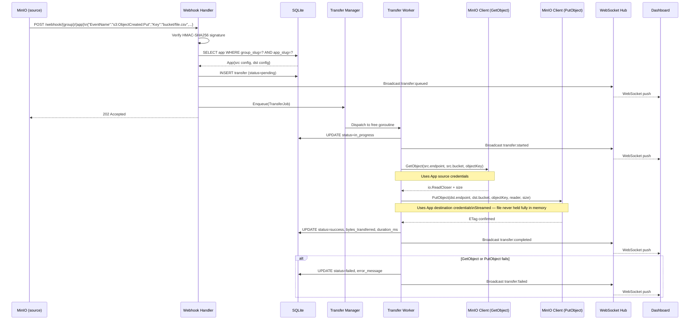
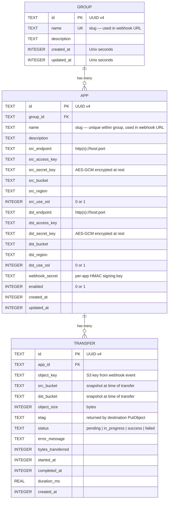
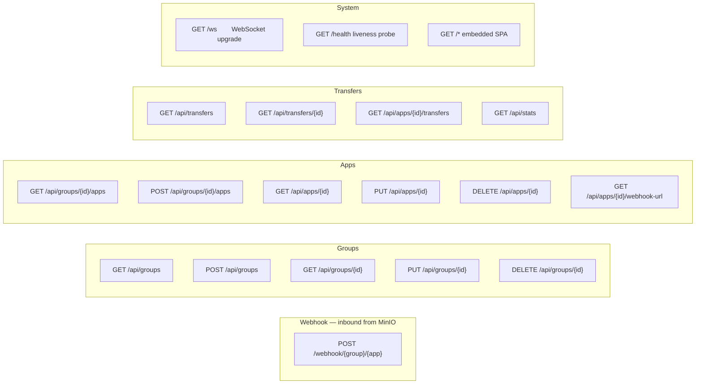
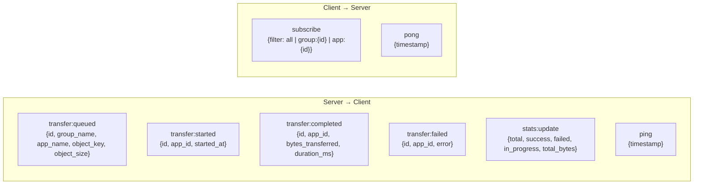
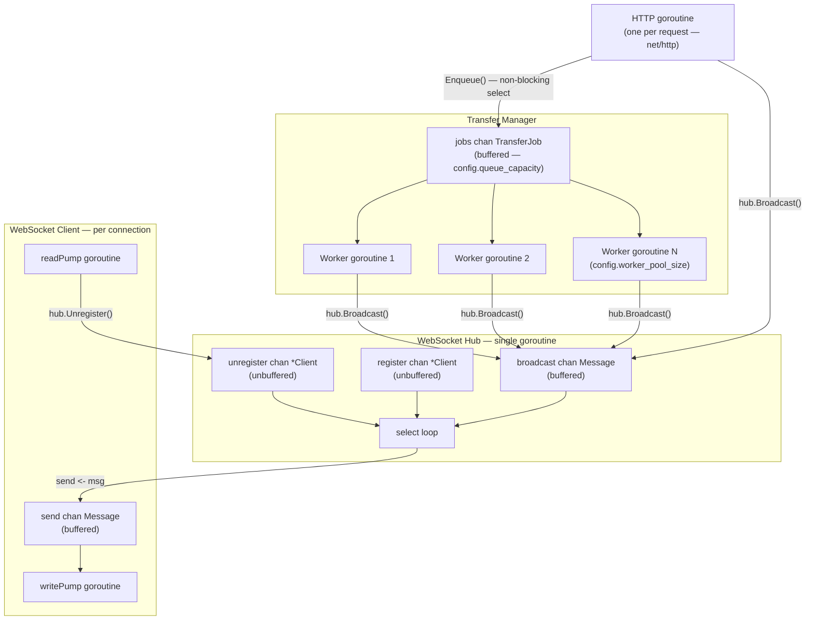
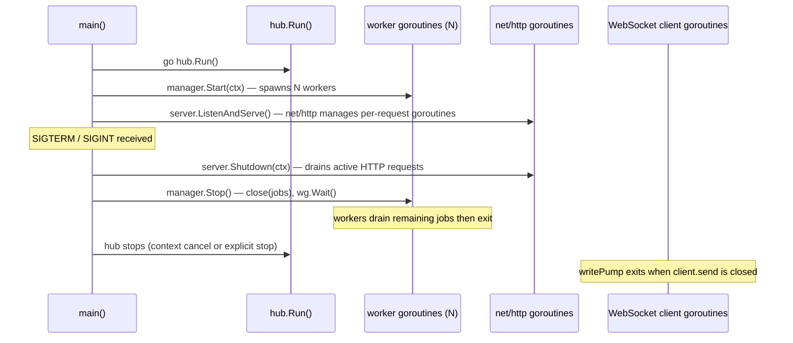
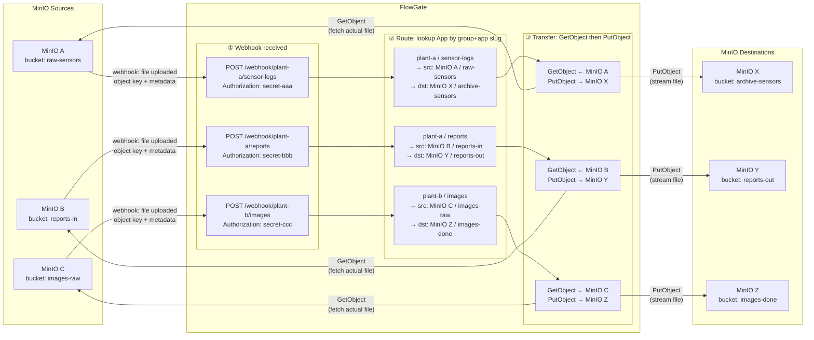

# FlowGate — Build & Architecture Guide

## Overview

FlowGate is a lightweight S3 object transfer gateway that runs **inside the same network** as your MinIO instances. It receives webhook events when objects are created, streams them from source to destination buckets, and provides a real-time dashboard for monitoring all transfers.

The proxy does not sit on a network boundary. There are no hardware diodes in the data path.
All communication — webhook delivery and both S3 calls — happens over the local network.

```
 ┌─────────────────────────────────────────────────────────┐
 │                    Same Network                         │
 │                                                         │
 │   MinIO A ──webhook──▶ FlowGate ──GetObject──▶ MinIO A  │
 │   (source bucket)           │        (same instance)    │
 │                             │                           │
 │                             └──PutObject──▶ MinIO B     │
 │                                            (dest bucket)│
 └─────────────────────────────────────────────────────────┘
```

---

## Concepts

| Term | What it means |
|---|---|
| **Group** | A logical grouping of Apps. Named after the diode methodology convention. Think of it as a project or a department — a namespace that holds multiple transfer pipelines. |
| **App** | A single transfer pipeline inside a Group. It owns one webhook endpoint, one source MinIO config, and one destination MinIO config. |
| **Transfer** | One file movement triggered by one webhook event — GetObject from source, PutObject to destination. |

### Why does each App store source MinIO credentials?

MinIO webhooks carry only **metadata**: the object key, bucket name, event type, and size.
The file itself is not in the webhook body. To retrieve the file the proxy must call
`GetObject` on the source MinIO using stored credentials. Because each App can point to a
completely different MinIO endpoint (different host, port, access key, secret key, bucket),
every App stores its own independent source and destination config.

```
Webhook arrives  →  "object reports/jan.csv created in bucket analytics"
                     (metadata only — no file, no credentials)

App config       →  source:  endpoint=minio-a:9000, bucket=analytics, key=••••
                    dest:    endpoint=minio-b:9000, bucket=archive,   key=••••

Worker           →  GetObject(minio-a, "analytics", "reports/jan.csv")
                    PutObject(minio-b, "archive",   "reports/jan.csv")
```

---

## Technology Stack

| Layer | Choice | Reason |
|---|---|---|
| Language | **Go 1.25** | Single binary, strong concurrency, easy cross-compilation |
| HTTP router | `net/http` + `chi` v5 | Lightweight, idiomatic, no heavy framework |
| MinIO client | `minio-go` v7 | Official SDK, streams objects without loading them fully in memory |
| Database | SQLite via `modernc.org/sqlite` | Pure-Go (no CGO), zero external process, perfect for a single-node service |
| WebSocket | `gorilla/websocket` | Stable fan-out pattern for live dashboard updates |
| Config | YAML via `gopkg.in/yaml.v3` | Human-readable, `${ENV_VAR}` interpolation |
| Frontend | Vanilla HTML + JS (embedded) | No build step — baked into the binary via `go:embed` |
| Logging | `log/slog` (stdlib, Go 1.21+) | Structured JSON logging, zero extra dependencies |

---

## Project Structure

```
flowgate/
├── cmd/
│   └── flowgate/
│       └── main.go                  # Entry point — wire deps, start server
│
├── internal/
│   ├── config/
│   │   ├── model.go                 # Typed config structs
│   │   └── loader.go                # Load + validate YAML, interpolate env vars
│   │
│   ├── server/
│   │   ├── server.go                # http.Server setup, graceful shutdown
│   │   ├── router.go                # Route registration (chi mux)
│   │   └── middleware.go            # Request logging, panic recovery, request-id
│   │
│   ├── webhook/
│   │   ├── handler.go               # Receive MinIO event, resolve App, enqueue job
│   │   ├── validator.go             # HMAC-SHA256 signature verification
│   │   └── event.go                 # MinIO S3 event JSON structures
│   │
│   ├── group/
│   │   ├── model.go                 # Group, App, MinIOConfig structs
│   │   └── service.go               # CRUD logic, webhook URL generator
│   │
│   ├── transfer/
│   │   ├── model.go                 # Transfer struct, TransferStatus enum
│   │   ├── manager.go               # Buffered channel queue, worker pool lifecycle
│   │   └── worker.go                # GetObject → PutObject, streamed
│   │
│   ├── storage/
│   │   ├── minio.go                 # MinIO client wrapper (GetObject / PutObject)
│   │   ├── store.go                 # SQLite repository — interface + implementation
│   │   └── migrations.go            # Embedded SQL schema migrations
│   │
│   ├── hub/
│   │   ├── hub.go                   # WebSocket broadcast hub
│   │   ├── client.go                # Per-connection read/write goroutines
│   │   └── message.go               # Typed event message structs + JSON encoding
│   │
│   └── dashboard/
│       ├── handler.go               # Serve embedded SPA + health endpoint
│       └── api.go                   # REST API handlers
│
├── web/
│   ├── index.html                   # Dashboard shell
│   ├── app.js                       # Vanilla JS — REST + WebSocket + DOM
│   └── style.css                    # Styling
│
├── migrations/
│   └── 001_initial_schema.sql       # SQLite schema (embedded via go:embed)
│
├── config.example.yaml
├── go.mod
├── go.sum
├── Dockerfile
├── docker-compose.yml
└── BUILD.md
```

---

## Architecture Diagrams

### System Overview

Everything in this diagram is on the same network. No boundary is crossed.



---

### How Groups and Apps Are Organised



Each App has **fully independent** source and destination MinIO configs.
Apps in the same Group share nothing except the grouping name in the URL.

---

### Webhook to Transfer — Full Sequence



---

### Database Schema



---

### API Surface



---

### WebSocket Event Protocol



---

## Key Domain Models

### Group, App, MinIOConfig

```go
// internal/group/model.go

type Group struct {
    ID          string    `json:"id"          db:"id"`
    Name        string    `json:"name"        db:"name"`        // slug used in webhook URL
    Description string    `json:"description" db:"description"`
    CreatedAt   time.Time `json:"created_at"  db:"created_at"`
    UpdatedAt   time.Time `json:"updated_at"  db:"updated_at"`
}

// App is a single file-transfer pipeline.
// Src is the MinIO instance the webhook came from (GetObject).
// Dst is the MinIO instance to write the file to (PutObject).
// Both are fully independent — different endpoints, creds, buckets.
type App struct {
    ID            string      `json:"id"          db:"id"`
    GroupID     string      `json:"group_id"  db:"group_id"`
    Name          string      `json:"name"        db:"name"`         // slug used in webhook URL
    Description   string      `json:"description" db:"description"`
    Src           MinIOConfig `json:"src"`
    Dst           MinIOConfig `json:"dst"`
    WebhookSecret string      `json:"-"           db:"webhook_secret"`
    Enabled       bool        `json:"enabled"     db:"enabled"`
    CreatedAt     time.Time   `json:"created_at"  db:"created_at"`
    UpdatedAt     time.Time   `json:"updated_at"  db:"updated_at"`
}

// MinIOConfig holds all connection details for one MinIO instance.
// SecretKey is encrypted at rest and never appears in API responses.
type MinIOConfig struct {
    Endpoint  string `json:"endpoint"   db:"endpoint"`
    AccessKey string `json:"access_key" db:"access_key"`
    SecretKey string `json:"-"          db:"secret_key"` // AES-GCM encrypted, never serialised
    Bucket    string `json:"bucket"     db:"bucket"`
    Region    string `json:"region"     db:"region"`
    UseSSL    bool   `json:"use_ssl"    db:"use_ssl"`
}
```

### Transfer

```go
// internal/transfer/model.go

type TransferStatus string

const (
    StatusPending    TransferStatus = "pending"
    StatusInProgress TransferStatus = "in_progress"
    StatusSuccess    TransferStatus = "success"
    StatusFailed     TransferStatus = "failed"
)

type Transfer struct {
    ID               string         `json:"id"                 db:"id"`
    AppID            string         `json:"app_id"             db:"app_id"`
    ObjectKey        string         `json:"object_key"         db:"object_key"`
    SrcBucket        string         `json:"src_bucket"         db:"src_bucket"`
    DstBucket        string         `json:"dst_bucket"         db:"dst_bucket"`
    ObjectSize       int64          `json:"object_size"        db:"object_size"`
    ETag             string         `json:"etag"               db:"etag"`
    Status           TransferStatus `json:"status"             db:"status"`
    ErrorMessage     string         `json:"error_message"      db:"error_message"`
    BytesTransferred int64          `json:"bytes_transferred"  db:"bytes_transferred"`
    StartedAt        *time.Time     `json:"started_at"         db:"started_at"`
    CompletedAt      *time.Time     `json:"completed_at"       db:"completed_at"`
    DurationMs       float64        `json:"duration_ms"        db:"duration_ms"`
    CreatedAt        time.Time      `json:"created_at"         db:"created_at"`
}

type TransferJob struct {
    Transfer  Transfer
    App       group.App
    ObjectKey string
}
```

### Core Interfaces

```go
// internal/storage/store.go

type Store interface {
    CreateGroup(ctx context.Context, p *group.Group) error
    GetGroup(ctx context.Context, id string) (*group.Group, error)
    ListGroups(ctx context.Context) ([]group.Group, error)
    UpdateGroup(ctx context.Context, p *group.Group) error
    DeleteGroup(ctx context.Context, id string) error

    CreateApp(ctx context.Context, a *group.App) error
    GetApp(ctx context.Context, id string) (*group.App, error)
    // Hot path — resolves {groupSlug}/{appSlug} to a full App in one indexed query.
    GetAppByRoute(ctx context.Context, groupSlug, appSlug string) (*group.App, error)
    ListAppsByGroup(ctx context.Context, groupID string) ([]group.App, error)
    UpdateApp(ctx context.Context, a *group.App) error
    DeleteApp(ctx context.Context, id string) error

    CreateTransfer(ctx context.Context, t *transfer.Transfer) error
    GetTransfer(ctx context.Context, id string) (*transfer.Transfer, error)
    UpdateTransfer(ctx context.Context, t *transfer.Transfer) error
    ListTransfers(ctx context.Context, opts ListTransfersOpts) ([]transfer.Transfer, error)
    GetStats(ctx context.Context) (*TransferStats, error)
}

// internal/storage/minio.go

type ObjectStorage interface {
    GetObject(ctx context.Context, cfg group.MinIOConfig, key string) (io.ReadCloser, int64, error)
    PutObject(ctx context.Context, cfg group.MinIOConfig, key string, r io.Reader, size int64) error
    BucketExists(ctx context.Context, cfg group.MinIOConfig) (bool, error)
}

// internal/transfer/manager.go

type Manager interface {
    Enqueue(job TransferJob) error  // returns ErrQueueFull if channel is at capacity
    Start(ctx context.Context)
    Stop()
    QueueDepth() int
}
```

---

## Configuration Reference

```yaml
# config.example.yaml

server:
  host: "0.0.0.0"
  port: 8080
  read_timeout: "30s"
  write_timeout: "30s"
  idle_timeout: "120s"

database:
  path: "./flowgate.db"
  max_open_connections: 5
  max_idle_connections: 2

transfer:
  worker_pool_size: 10     # concurrent transfer goroutines
  queue_capacity: 1000     # buffered channel size; 503 returned when full so MinIO retries
  retry_attempts: 3
  retry_backoff: "5s"

logging:
  level: "info"            # debug | info | warn | error
  format: "json"           # json | text

security:
  # Derives the AES-GCM key used to encrypt MinIO secret keys stored in SQLite.
  secret_key: "${SECRET_KEY}"

dashboard:
  enabled: true
  auth_enabled: false
  username: "admin"
  password: "${DASH_PASSWORD}"
```

---

## Build Instructions

### Prerequisites

- **Go 1.25** — <https://go.dev/dl/>
- **Git**
- **Docker** (optional)

### Local Development

```bash
go mod download
go run ./cmd/flowgate --config config.yaml

# Release binary
go build -o bin/flowgate ./cmd/flowgate

# Cross-compile Linux amd64
GOOS=linux GOARCH=amd64 go build -o bin/flowgate-linux-amd64 ./cmd/flowgate
```

### Tests

```bash
go test ./...
go test -race ./...
INTEGRATION=true go test ./internal/storage/...
```

### Docker

```dockerfile
# Dockerfile
FROM golang:1.25-alpine AS builder
WORKDIR /app
COPY go.mod go.sum ./
RUN go mod download
COPY . .
RUN CGO_ENABLED=0 GOOS=linux go build -ldflags="-s -w" -o /flowgate ./cmd/flowgate

FROM scratch
COPY --from=builder /flowgate /flowgate
COPY --from=builder /etc/ssl/certs/ca-certificates.crt /etc/ssl/certs/
EXPOSE 8080
ENTRYPOINT ["/flowgate"]
```

### Docker Compose (Development)

```yaml
# docker-compose.yml
services:
  flowgate:
    build: .
    ports:
      - "8080:8080"
    volumes:
      - ./config.yaml:/config.yaml
      - ./data:/data
    environment:
      SECRET_KEY: "change-me-in-production"
    depends_on:
      - minio-src
      - minio-dst

  minio-src:
    image: minio/minio:latest
    command: server /data --console-address ":9001"
    ports:
      - "9000:9000"
      - "9001:9001"
    environment:
      MINIO_ROOT_USER: minioadmin
      MINIO_ROOT_PASSWORD: minioadmin

  minio-dst:
    image: minio/minio:latest
    command: server /data --console-address ":9003"
    ports:
      - "9002:9000"
      - "9003:9001"
    environment:
      MINIO_ROOT_USER: minioadmin
      MINIO_ROOT_PASSWORD: minioadmin
```

---

## Go Module Dependencies

```
module github.com/yourorg/flowgate

go 1.25

require (
    github.com/go-chi/chi/v5     v5.x.x   // HTTP router
    github.com/gorilla/websocket  v1.x.x   // WebSocket hub
    github.com/minio/minio-go/v7  v7.x.x   // S3 GetObject / PutObject
    modernc.org/sqlite            v1.x.x   // Pure-Go SQLite, no CGO
    gopkg.in/yaml.v3             v3.x.x   // YAML config
    github.com/google/uuid        v1.x.x   // UUID v4
)
```

> Exact versions pinned in `go.sum` after `go mod tidy`.

---

## Design Decisions

| Decision | Rationale |
|---|---|
| **Stream, never buffer** | `GetObject` returns an `io.Reader` passed directly to `PutObject`. The file is never fully held in memory — critical for large objects. |
| **Per-App independent MinIO configs** | Each App owns its own src and dst connection details. Two Apps in the same Group can point to completely different MinIO hosts, credentials, and buckets. |
| **503 back-pressure when queue full** | If all workers are busy and the queue is at capacity, the webhook handler returns `503`. MinIO will retry. No events are silently dropped. |
| **Slug-based webhook URLs** | `/webhook/{group}/{app}` is human-readable and stable. `GetAppByRoute` resolves both slugs in one indexed SQLite query on the hot inbound path. |
| **`modernc.org/sqlite` (pure Go)** | No CGO. Enables `CGO_ENABLED=0` builds, `FROM scratch` Docker images, trivial cross-compilation. |
| **`go:embed` for the dashboard** | HTML/JS/CSS baked into the binary at build time. No external static server or volume mount needed. |
| **AES-GCM credential encryption** | MinIO `SecretKey` values encrypted before storage in SQLite. `json:"-"` ensures they never appear in any API response. |
| **Graceful shutdown** | Listens for `SIGTERM`/`SIGINT`. Stops accepting new webhooks, drains in-flight transfers, then exits cleanly. |

---

## Concurrency Model

Every unit of work that can block — receiving a webhook, transferring a file, pushing a WebSocket
event — is handled by a dedicated goroutine communicating exclusively through typed channels.
No shared mutable state is accessed without a lock; most coordination uses channels so the
compiler and race detector can verify correctness.

---

### Channel Architecture



---

### Rule: the webhook handler must never block

The HTTP handler runs in its own goroutine per request (managed by `net/http`). It must return
quickly so the connection is not held open. The only blocking operation allowed is the SQLite
insert of the pending transfer record. Everything else is a non-blocking channel send:

```go
// internal/webhook/handler.go

func (h *Handler) ServeHTTP(w http.ResponseWriter, r *http.Request) {
    // 1. Verify HMAC — fast, pure CPU
    // 2. Lookup App from SQLite — single indexed query
    // 3. Insert pending Transfer record — SQLite write
    // 4. Non-blocking enqueue:
    if err := h.manager.Enqueue(job); err != nil {
        // queue full — tell MinIO to retry
        http.Error(w, "queue full", http.StatusServiceUnavailable)
        return
    }
    // 5. Non-blocking broadcast to WebSocket hub
    h.hub.Broadcast(Message{Type: MsgTransferQueued, Payload: ...})
    w.WriteHeader(http.StatusAccepted) // return immediately
}
```

---

### Transfer Manager — Worker Pool

The manager owns a single buffered `jobs` channel and a fixed pool of worker goroutines.
Workers are started once at startup and run for the lifetime of the process.
The channel provides both the work queue and the back-pressure mechanism.

```go
// internal/transfer/manager.go

type manager struct {
    jobs    chan TransferJob  // buffered — capacity = config.queue_capacity
    wg      sync.WaitGroup   // tracks all running workers
    workers int
    store   storage.Store
    minio   storage.ObjectStorage
    hub     *hub.Hub
}

func (m *manager) Start(ctx context.Context) {
    for i := 0; i < m.workers; i++ {
        m.wg.Add(1)
        go func() {
            defer m.wg.Done()
            for {
                select {
                case job, ok := <-m.jobs:
                    if !ok {
                        return // channel closed — drain complete, exit
                    }
                    m.process(ctx, job)
                case <-ctx.Done():
                    return // root context cancelled
                }
            }
        }()
    }
}

// Enqueue is called by the webhook handler. Non-blocking.
// Returns ErrQueueFull immediately if the channel is at capacity.
func (m *manager) Enqueue(job TransferJob) error {
    select {
    case m.jobs <- job:
        return nil
    default:
        return ErrQueueFull // caller returns 503 to MinIO, which will retry
    }
}

// Stop closes the jobs channel (signals workers to drain) then waits.
// All jobs already in the channel are completed before workers exit.
func (m *manager) Stop() {
    close(m.jobs) // workers range/select will see !ok after draining
    m.wg.Wait()   // block until every in-flight transfer finishes
}
```

**Back-pressure flow:**
```
Queue full?  →  Enqueue() returns ErrQueueFull
             →  Webhook handler returns 503
             →  MinIO retries the event after its configured retry interval
             →  No event is silently dropped
```

---

### Worker — Streaming Transfer

Each worker calls `process()` which does the actual GetObject → PutObject.
The `io.Reader` from GetObject is piped directly into PutObject — the object is never
fully buffered in memory regardless of size.

```go
// internal/transfer/worker.go

func (m *manager) process(ctx context.Context, job TransferJob) {
    // Give each transfer a timeout derived from the root context
    tCtx, cancel := context.WithTimeout(ctx, transferTimeout)
    defer cancel()

    _ = m.store.UpdateTransfer(tCtx, job.Transfer.ID, StatusInProgress, nil)
    m.hub.Broadcast(startedMsg(job))

    // GetObject returns an io.ReadCloser — streaming, no full buffer
    rc, size, err := m.minio.GetObject(tCtx, job.App.Src, job.ObjectKey)
    if err != nil {
        m.fail(tCtx, job, err)
        return
    }
    defer rc.Close()

    // PutObject reads from the same io.Reader — single stream, no copy
    if err := m.minio.PutObject(tCtx, job.App.Dst, job.ObjectKey, rc, size); err != nil {
        m.fail(tCtx, job, err)
        return
    }

    m.store.UpdateTransfer(tCtx, job.Transfer.ID, StatusSuccess, nil)
    m.hub.Broadcast(completedMsg(job))
}
```

---

### WebSocket Hub — Single-Goroutine Fan-out

The hub runs in exactly **one goroutine** and owns all client state.
No mutex is needed because only the hub goroutine reads or writes the client map.
All external code communicates with the hub exclusively through its channels.

```go
// internal/hub/hub.go

type Hub struct {
    clients    map[*Client]struct{}
    broadcast  chan Message  // buffered — workers send here without blocking
    register   chan *Client
    unregister chan *Client
}

func (h *Hub) Run() {
    for {
        select {
        case client := <-h.register:
            h.clients[client] = struct{}{}

        case client := <-h.unregister:
            if _, ok := h.clients[client]; ok {
                delete(h.clients, client)
                close(client.send) // signals writePump to exit
            }

        case msg := <-h.broadcast:
            for client := range h.clients {
                select {
                case client.send <- msg:
                    // delivered
                default:
                    // client send buffer full — slow consumer, drop and disconnect
                    delete(h.clients, client)
                    close(client.send)
                }
            }
        }
    }
}

// Broadcast is safe to call from any goroutine.
func (h *Hub) Broadcast(msg Message) {
    h.broadcast <- msg
}
```

---

### WebSocket Client — Two Goroutines Per Connection

Each connected browser gets two goroutines: one for reading (pong/subscribe), one for writing.
They communicate through the client's `send` channel. Neither touches shared state directly.

```go
// internal/hub/client.go

type Client struct {
    hub  *Hub
    conn *websocket.Conn
    send chan Message  // buffered — hub writes here, writePump drains
}

// readPump reads control frames (pong, subscribe filter) from the browser.
// When the connection closes it unregisters the client from the hub.
func (c *Client) readPump() {
    defer func() {
        c.hub.unregister <- c
        c.conn.Close()
    }()
    c.conn.SetReadDeadline(time.Now().Add(pongWait))
    c.conn.SetPongHandler(func(string) error {
        c.conn.SetReadDeadline(time.Now().Add(pongWait))
        return nil
    })
    for {
        _, _, err := c.conn.ReadMessage()
        if err != nil {
            return // connection closed or error — triggers deferred unregister
        }
    }
}

// writePump drains the send channel and writes messages to the WebSocket.
// Also sends periodic pings to detect dead connections.
func (c *Client) writePump() {
    ticker := time.NewTicker(pingInterval)
    defer func() {
        ticker.Stop()
        c.conn.Close()
    }()
    for {
        select {
        case msg, ok := <-c.send:
            c.conn.SetWriteDeadline(time.Now().Add(writeWait))
            if !ok {
                c.conn.WriteMessage(websocket.CloseMessage, nil)
                return // hub closed the channel
            }
            if err := c.conn.WriteJSON(msg); err != nil {
                return
            }
        case <-ticker.C:
            c.conn.SetWriteDeadline(time.Now().Add(writeWait))
            if err := c.conn.WriteMessage(websocket.PingMessage, nil); err != nil {
                return
            }
        }
    }
}
```

---

### Goroutine Lifecycle Summary



---

### Graceful Shutdown — Step by Step

```go
// cmd/flowgate/main.go (sketch)

ctx, stop := signal.NotifyContext(context.Background(), syscall.SIGTERM, syscall.SIGINT)
defer stop()

go hub.Run()
manager.Start(ctx)
go server.ListenAndServe()

<-ctx.Done() // block until signal

// 1. Stop accepting new HTTP requests; wait for active handlers to finish
shutdownCtx, cancel := context.WithTimeout(context.Background(), 30*time.Second)
defer cancel()
server.Shutdown(shutdownCtx)

// 2. Close jobs channel; workers finish in-flight transfers then exit
manager.Stop()
```

**Shutdown order matters:**
1. HTTP server stops first — no new webhooks enqueued after this point
2. Transfer manager drains — all jobs already in the channel are completed
3. Process exits cleanly — no transfers are abandoned mid-stream

---

### Concurrency Invariants

| Invariant | How it is enforced |
|---|---|
| Only one goroutine writes to the hub's client map | Hub goroutine owns the map; all access via channels |
| Webhook handler never blocks on transfer work | `Enqueue` uses a non-blocking `select`; returns 503 on full |
| Objects are never fully loaded into memory | `io.ReadCloser` from `GetObject` is the only reference; passed directly to `PutObject` |
| In-flight transfers complete before shutdown | `sync.WaitGroup` in manager; `Stop()` blocks until `wg.Wait()` returns |
| Slow WebSocket clients don't block broadcasts | Per-client buffered `send` channel; client dropped if buffer full |
| Each transfer has an independent timeout | `context.WithTimeout` derived per job inside `process()` |

---

## End-to-End Setup Guide

This section walks through exactly how a group, an app, and the MinIO webhook are created and
wired together so the proxy can route events correctly.

---

### How Routing Works

The webhook URL encodes both the group and the app name as path segments:

```
POST /webhook/{group-slug}/{app-slug}
```

When MinIO fires an event the proxy:
1. Extracts `group-slug` and `app-slug` from the URL
2. Runs `SELECT * FROM apps JOIN groups ... WHERE group.name = ? AND app.name = ?`
3. Gets back the full App record — src MinIO creds, dst MinIO creds, webhook secret
4. Verifies the request's `Authorization` header against the stored webhook secret
5. Enqueues the transfer job

Two different apps on two different buckets each get their own URL, their own secret, and their
own independent src/dst config. There is no ambiguity.

```
Group A / App 1  →  POST /webhook/group-a/app1   →  secret-aaa
Group A / App 2  →  POST /webhook/group-a/app2   →  secret-bbb
Group B / App 3  →  POST /webhook/group-b/app3   →  secret-ccc
```

Each of those three webhook URLs is configured in a different MinIO instance (or bucket).
The proxy resolves each one independently.

---

### Step 1 — Start the Proxy

```bash
cp config.example.yaml config.yaml
# edit config.yaml: set your SECRET_KEY, port, db path

go run ./cmd/flowgate --config config.yaml
# or: docker compose up
```

The proxy listens on `http://0.0.0.0:8080` by default.
Open `http://localhost:8080` in a browser to see the dashboard.

---

### Step 2 — Create a Group

A group is just a named namespace. Create it via the REST API:

```bash
curl -s -X POST http://localhost:8080/api/groups \
  -H "Content-Type: application/json" \
  -d '{
    "name": "plant-a",
    "description": "Production line A data feeds"
  }' | jq
```

Response:

```json
{
  "id": "a1b2c3d4-...",
  "name": "plant-a",
  "description": "Production line A data feeds",
  "created_at": "2026-03-16T10:00:00Z"
}
```

Save the `id` — you need it to create apps inside this group.

---

### Step 3 — Create an App Inside the Group

An app binds one webhook endpoint to one src MinIO bucket and one dst MinIO bucket.
Every connection detail is stored per-app — endpoint, credentials, bucket name.

```bash
GROUP_ID="a1b2c3d4-..."   # from step 2

curl -s -X POST http://localhost:8080/api/groups/${GROUP_ID}/apps \
  -H "Content-Type: application/json" \
  -d '{
    "name": "sensor-logs",
    "description": "Raw sensor CSV files from line A",
    "src": {
      "endpoint":   "http://minio-src:9000",
      "access_key": "src-access-key",
      "secret_key": "src-secret-key",
      "bucket":     "raw-sensors",
      "region":     "us-east-1",
      "use_ssl":    false
    },
    "dst": {
      "endpoint":   "http://minio-dst:9000",
      "access_key": "dst-access-key",
      "secret_key": "dst-secret-key",
      "bucket":     "archive-sensors",
      "region":     "us-east-1",
      "use_ssl":    false
    }
  }' | jq
```

Response:

```json
{
  "id": "e5f6g7h8-...",
  "group_id": "a1b2c3d4-...",
  "name": "sensor-logs",
  "src": {
    "endpoint":   "http://minio-src:9000",
    "access_key": "src-access-key",
    "bucket":     "raw-sensors"
  },
  "dst": {
    "endpoint":   "http://minio-dst:9000",
    "access_key": "dst-access-key",
    "bucket":     "archive-sensors"
  },
  "enabled": true,
  "created_at": "2026-03-16T10:01:00Z"
}
```

Note: `secret_key` fields are never returned in any response. They are stored AES-GCM encrypted.

---

### Step 4 — Get the Webhook URL and Secret

```bash
APP_ID="e5f6g7h8-..."

curl -s http://localhost:8080/api/apps/${APP_ID}/webhook-url | jq
```

Response:

```json
{
  "webhook_url":    "http://flowgate:8080/webhook/plant-a/sensor-logs",
  "webhook_secret": "generated-hmac-secret-value"
}
```

The `webhook_url` is what you configure in MinIO.
The `webhook_secret` is the `Authorization` token MinIO will send with every event.

> The proxy auto-generates the HMAC secret at app creation time. You can rotate it via
> `PUT /api/apps/{id}` with a new `webhook_secret` value, then update the MinIO config.

---

### Step 5 — Configure MinIO to Send Events to the Proxy

MinIO uses the `mc` CLI to register webhook targets and bind them to bucket events.
Each App needs its own named webhook target in the source MinIO instance.

#### 5a. Register the flowgate as a webhook target in MinIO

```bash
# Alias for the source MinIO instance
mc alias set minio-src http://minio-src:9000 src-access-key src-secret-key

# Register the webhook target
# The identifier (here: "plant-a-sensor-logs") is arbitrary but must be unique per MinIO instance
mc admin config set minio-src \
  notify_webhook:plant-a-sensor-logs \
  endpoint="http://flowgate:8080/webhook/plant-a/sensor-logs" \
  auth_token="generated-hmac-secret-value"

# Restart MinIO to apply the new config
mc admin service restart minio-src
```

#### 5b. Bind the webhook target to the source bucket

```bash
# Send an event to the proxy whenever any object is created in raw-sensors
mc event add minio-src/raw-sensors \
  arn:minio:sqs::plant-a-sensor-logs:webhook \
  --event put

# Verify the event binding
mc event list minio-src/raw-sensors
```

Expected output:
```
arn:minio:sqs::plant-a-sensor-logs:webhook   s3:ObjectCreated:Put   Filter:
```

#### 5c. Repeat for every additional App

Each App in any Group needs its own named target in its own source MinIO:

```bash
# App3 in Group B — different MinIO instance
mc alias set minio-b http://minio-b:9000 b-access-key b-secret-key

mc admin config set minio-b \
  notify_webhook:plant-b-app3 \
  endpoint="http://flowgate:8080/webhook/plant-b/app3" \
  auth_token="app3-hmac-secret"

mc admin service restart minio-b

mc event add minio-b/source-bucket-b \
  arn:minio:sqs::plant-b-app3:webhook \
  --event put
```

---

### Step 6 — What the MinIO Webhook Payload Looks Like

When a file is uploaded to the source bucket, MinIO POSTs this JSON body to the proxy:

```json
{
  "EventName": "s3:ObjectCreated:Put",
  "Key": "raw-sensors/2026/03/16/sensor-001.csv",
  "Records": [
    {
      "eventVersion": "2.0",
      "eventSource": "minio:s3",
      "eventTime": "2026-03-16T10:05:00.000Z",
      "eventName": "s3:ObjectCreated:Put",
      "s3": {
        "bucket": {
          "name": "raw-sensors",
          "arn":  "arn:aws:s3:::raw-sensors"
        },
        "object": {
          "key":         "2026%2F03%2F16%2Fsensor-001.csv",
          "size":        48392,
          "eTag":        "d41d8cd98f00b204e9800998ecf8427e",
          "contentType": "text/csv"
        }
      }
    }
  ]
}
```

Key points the proxy handles:
- `Records[0].s3.object.key` is **URL-encoded** — the proxy decodes it before calling GetObject
- `Records[0].s3.bucket.name` confirms the source bucket
- `Records[0].s3.object.size` is passed to PutObject so MinIO can stream without chunking
- The `Authorization` header carries the `auth_token` value — verified against `webhook_secret`

---

### Step 7 — Test the Full Flow

Upload any file to the source bucket and watch it appear in the destination:

```bash
# Upload a test file to the source bucket
mc cp ./test-file.csv minio-src/raw-sensors/2026/03/16/test-file.csv

# Watch the dashboard at http://localhost:8080
# Or poll the transfers API:
curl -s http://localhost:8080/api/transfers | jq '.[] | {status, object_key, duration_ms}'
```

Expected transfer lifecycle visible in the dashboard:
```
transfer:queued     → proxy received the webhook
transfer:started    → worker picked up the job, calling GetObject
transfer:completed  → PutObject succeeded, file is in archive-sensors bucket
```

Verify the file arrived in the destination:
```bash
mc ls minio-dst/archive-sensors/2026/03/16/
```

---

### Multi-App Routing — Visual Summary

The diagram reads left → middle → right:
- **Left** — MinIO source instances, each fires a webhook when a file is uploaded
- **Middle** — FlowGate receives the webhook, resolves the app from the URL, calls GetObject back to the source, then calls PutObject to the destination
- **Right** — MinIO destination instances, each receives the file via PutObject



**What happens at each numbered step:**

| Step | What | Detail |
|---|---|---|
| **①** | Webhook received | MinIO POSTs to `/webhook/{group}/{app}`. Body has the object key and size. The file is NOT in the payload. |
| **②** | Route resolved | Proxy extracts `group` and `app` from the URL path. One DB query returns the full App config — src endpoint + creds + bucket, dst endpoint + creds + bucket. |
| **③** | File transferred | Worker calls `GetObject` on the **source MinIO** using the object key from the webhook and the stored src credentials. The resulting `io.Reader` is streamed directly into `PutObject` on the **destination MinIO** using stored dst credentials. The file is never buffered in full. |

Each webhook URL is unambiguous. The proxy resolves `{group}/{app}` to a full, independent
App config in a single database lookup. Two apps with the same name in different groups
are completely separate — `plant-a/sensor-logs` and `plant-b/sensor-logs` resolve to
different DB rows with different src and dst configs.

---

### HMAC Signature Verification

MinIO sends the `auth_token` value as the `Authorization` header on every webhook request.
The proxy verifies this on every inbound request before doing anything else:

```go
// internal/webhook/validator.go

func Verify(r *http.Request, storedSecret string) error {
    token := r.Header.Get("Authorization")
    if token == "" {
        return ErrMissingToken
    }
    // constant-time comparison — prevents timing attacks
    if !hmac.Equal([]byte(token), []byte(storedSecret)) {
        return ErrInvalidToken
    }
    return nil
}
```

If verification fails the handler returns `401` and no transfer is enqueued.
Each App has its own independent secret so a compromised secret for one App does not
affect any other App.

---

## API Reference

All API endpoints return `application/json`. Error responses always include a `{"error": "..."}` body.

---

### Groups

#### `GET /api/groups`
List all groups.

Response `200`:
```json
[
  {
    "id": "a1b2c3d4-...",
    "name": "plant-a",
    "description": "Production line A",
    "created_at": "2026-03-17T10:00:00Z",
    "updated_at": "2026-03-17T10:00:00Z"
  }
]
```

#### `POST /api/groups`
Create a group.

Request:
```json
{ "name": "plant-a", "description": "Production line A" }
```

- `name` — required, lowercase slug, unique, used in webhook URL path
- `description` — optional

Response `201`: the created Group object.

#### `GET /api/groups/{id}`
Get a single group by UUID.

Response `200`: Group object. `404` if not found.

#### `PUT /api/groups/{id}`
Update a group's name or description.

Request: same shape as POST, all fields optional.

Response `200`: updated Group object.

#### `DELETE /api/groups/{id}`
Delete a group and all its apps. Transfers records are retained for audit.

Response `204`. `409` if any app in the group has an active transfer in progress.

---

### Apps

#### `GET /api/groups/{id}/apps`
List all apps inside a group.

Response `200`:
```json
[
  {
    "id": "e5f6g7h8-...",
    "group_id": "a1b2c3d4-...",
    "name": "sensor-logs",
    "description": "Raw sensor CSV files",
    "src": {
      "endpoint":   "http://minio-src:9000",
      "access_key": "src-access-key",
      "bucket":     "raw-sensors",
      "region":     "us-east-1",
      "use_ssl":    false
    },
    "dst": {
      "endpoint":   "http://minio-dst:9000",
      "access_key": "dst-access-key",
      "bucket":     "archive-sensors",
      "region":     "us-east-1",
      "use_ssl":    false
    },
    "enabled": true,
    "created_at": "2026-03-17T10:01:00Z",
    "updated_at": "2026-03-17T10:01:00Z"
  }
]
```

Note: `secret_key` is never returned in any response.

#### `POST /api/groups/{id}/apps`
Create an app inside a group.

Request:
```json
{
  "name": "sensor-logs",
  "description": "Raw sensor CSV files",
  "src": {
    "endpoint":   "http://minio-src:9000",
    "access_key": "src-access-key",
    "secret_key": "src-secret-key",
    "bucket":     "raw-sensors",
    "region":     "us-east-1",
    "use_ssl":    false
  },
  "dst": {
    "endpoint":   "http://minio-dst:9000",
    "access_key": "dst-access-key",
    "secret_key": "dst-secret-key",
    "bucket":     "archive-sensors",
    "region":     "us-east-1",
    "use_ssl":    false
  }
}
```

- `name` — required, lowercase slug, unique within group
- `src` / `dst` — all sub-fields required except `region` (defaults to `us-east-1`)
- `secret_key` — accepted on create/update, never returned in responses
- A `webhook_secret` is auto-generated at creation time

Response `201`: created App object (without secret keys).

#### `GET /api/apps/{id}`
Get a single app by UUID.

Response `200`: App object. `404` if not found.

#### `PUT /api/apps/{id}`
Update an app. Accepts the same body as POST. All fields optional — only provided fields are updated.

To rotate the webhook secret:
```json
{ "webhook_secret": "new-secret-value" }
```

Response `200`: updated App object.

#### `DELETE /api/apps/{id}`
Delete an app. Transfer records are retained.

Response `204`. `409` if the app has an active in-progress transfer.

#### `GET /api/apps/{id}/webhook-url`
Returns the full webhook URL and current webhook secret for this app.
Use this to configure the MinIO webhook target.

Response `200`:
```json
{
  "webhook_url":    "http://flowgate:8080/webhook/plant-a/sensor-logs",
  "webhook_secret": "generated-hmac-secret-value"
}
```

---

### Transfers

#### `GET /api/transfers`
List transfers with optional filters.

Query parameters:
| Param | Type | Default | Description |
|---|---|---|---|
| `app_id` | UUID | — | Filter by app |
| `group_id` | UUID | — | Filter by group |
| `status` | string | — | `pending`, `in_progress`, `success`, `failed` |
| `limit` | int | `50` | Max results (max `500`) |
| `offset` | int | `0` | Pagination offset |

Response `200`:
```json
{
  "transfers": [
    {
      "id":                "t1t2t3t4-...",
      "app_id":            "e5f6g7h8-...",
      "object_key":        "2026/03/17/sensor-001.csv",
      "src_bucket":        "raw-sensors",
      "dst_bucket":        "archive-sensors",
      "object_size":       48392,
      "etag":              "d41d8cd98f00b204e9800998ecf8427e",
      "status":            "success",
      "error_message":     "",
      "bytes_transferred": 48392,
      "started_at":        "2026-03-17T10:05:01Z",
      "completed_at":      "2026-03-17T10:05:02Z",
      "duration_ms":       843.2,
      "created_at":        "2026-03-17T10:05:00Z"
    }
  ],
  "total":  1,
  "limit":  50,
  "offset": 0
}
```

#### `GET /api/transfers/{id}`
Get a single transfer record.

Response `200`: Transfer object. `404` if not found.

#### `GET /api/apps/{id}/transfers`
Shorthand for `GET /api/transfers?app_id={id}`. Supports same query params.

#### `GET /api/stats`
Aggregate transfer statistics across all apps or filtered by group/app.

Query params: `group_id`, `app_id` (optional).

Response `200`:
```json
{
  "total_transfers":     1042,
  "success_count":       1038,
  "failed_count":        3,
  "in_progress_count":   1,
  "pending_count":       0,
  "total_bytes":         5368709120,
  "avg_duration_ms":     712.4,
  "last_transfer_at":    "2026-03-17T10:05:02Z"
}
```

---

### Webhook

#### `POST /webhook/{group}/{app}`
Inbound S3 event from MinIO. Not intended to be called directly.

Headers:
- `Authorization: <webhook_secret>` — must match the secret stored for this app

Body: standard MinIO S3 event JSON (see Step 6 in the Setup Guide).

Responses:
| Code | Meaning |
|---|---|
| `202` | Event accepted and queued |
| `400` | Malformed event payload |
| `401` | Missing or invalid Authorization header |
| `404` | No app found for this group+app slug |
| `503` | Transfer queue full — MinIO should retry |

---

### System

#### `GET /health`
Liveness probe. Returns `200` when the server is up and the database is reachable.

Response `200`:
```json
{ "status": "ok", "db": "ok", "queue_depth": 3 }
```

#### `GET /ws`
WebSocket upgrade endpoint. Used by the dashboard for live event streaming.
See the WebSocket Event Protocol section for message format.

---

## Environment Variables

All config values can also be set via environment variables using the pattern `FLOWGATE_<SECTION>_<KEY>` in uppercase. Environment variables override values from the config file.

| Variable | Config equivalent | Description |
|---|---|---|
| `FLOWGATE_SERVER_PORT` | `server.port` | HTTP listen port |
| `FLOWGATE_DATABASE_PATH` | `database.path` | SQLite file path |
| `FLOWGATE_TRANSFER_WORKER_POOL_SIZE` | `transfer.worker_pool_size` | Worker goroutine count |
| `FLOWGATE_TRANSFER_QUEUE_CAPACITY` | `transfer.queue_capacity` | Job channel buffer size |
| `FLOWGATE_SECURITY_SECRET_KEY` | `security.secret_key` | AES-GCM key for credential encryption |
| `FLOWGATE_LOGGING_LEVEL` | `logging.level` | `debug`, `info`, `warn`, `error` |
| `FLOWGATE_DASHBOARD_AUTH_ENABLED` | `dashboard.auth_enabled` | Enable basic auth on dashboard |
| `FLOWGATE_DASHBOARD_PASSWORD` | `dashboard.password` | Dashboard password |

---

## Operational Runbook

### Health Check

```bash
curl -s http://localhost:8080/health | jq
```

A healthy response:
```json
{ "status": "ok", "db": "ok", "queue_depth": 0 }
```

A high `queue_depth` means workers cannot keep up with incoming webhooks. Increase `transfer.worker_pool_size`.

---

### Viewing Logs

```bash
# Docker
docker compose logs -f flowgate

# Structured log fields
docker compose logs flowgate | jq 'select(.level=="error")'
```

Key log fields:
| Field | Description |
|---|---|
| `level` | `debug`, `info`, `warn`, `error` |
| `msg` | Human-readable message |
| `group` | Group slug |
| `app` | App slug |
| `transfer_id` | UUID of the transfer |
| `object_key` | S3 object key being transferred |
| `duration_ms` | Transfer duration |
| `error` | Error string on failures |

---

### Rotating a Webhook Secret

```bash
APP_ID="e5f6g7h8-..."
NEW_SECRET="$(openssl rand -hex 32)"

# 1. Update the app in the proxy
curl -s -X PUT http://localhost:8080/api/apps/${APP_ID} \
  -H "Content-Type: application/json" \
  -d "{\"webhook_secret\": \"${NEW_SECRET}\"}"

# 2. Update the MinIO webhook target with the new secret
mc admin config set minio-src \
  notify_webhook:plant-a-sensor-logs \
  auth_token="${NEW_SECRET}"

mc admin service restart minio-src
```

---

### Rotating MinIO Credentials

```bash
APP_ID="e5f6g7h8-..."

curl -s -X PUT http://localhost:8080/api/apps/${APP_ID} \
  -H "Content-Type: application/json" \
  -d '{
    "src": { "access_key": "new-src-key", "secret_key": "new-src-secret" },
    "dst": { "access_key": "new-dst-key", "secret_key": "new-dst-secret" }
  }'
```

Credentials are re-encrypted with AES-GCM immediately on save.

---

### Monitoring Queue Depth

If `queue_depth` from `/health` is consistently above zero, workers are saturated:

```bash
# Check current depth
curl -s http://localhost:8080/health | jq .queue_depth

# Increase worker pool without restart — edit config.yaml then send SIGHUP
# (or restart the container)
docker compose restart flowgate
```

---

### Troubleshooting

| Symptom | Likely cause | Fix |
|---|---|---|
| Webhook returns `401` | Wrong `auth_token` in MinIO config | Re-run `GET /api/apps/{id}/webhook-url` and update MinIO |
| Webhook returns `404` | Group or app slug mismatch | Check the URL slug matches the `name` field in the API |
| Webhook returns `503` | Transfer queue full | Increase `transfer.worker_pool_size` or `queue_capacity` |
| Transfer status `failed`, error contains `NoSuchKey` | Object deleted from source before GetObject ran | MinIO event delivered but object was removed — no retry needed |
| Transfer status `failed`, error contains `connection refused` | Source or destination MinIO unreachable | Check network, credentials, and endpoint config on the app |
| Dashboard shows no live events | WebSocket not connected | Check browser console for `ws://` connection errors; verify `/ws` is reachable |

---

## Air-Gapped Deployment

For environments without internet access, use `build.sh` on an internet-connected machine to
produce a self-contained `deployment/` folder. Copy that folder to the air-gapped host and run
`deploy.sh` there.

### What `build.sh` produces

```
deployment/
├── images/
│   ├── flowgate.tar.gz     # the proxy image
│   └── minio.tar.gz           # MinIO image
├── docker-compose.yml         # production compose (no build: directive)
├── config.example.yaml        # reference config
├── deploy.sh                  # run on the air-gapped host
└── manifest.txt               # image versions + build date
```

### On the internet-connected build machine

```bash
# Build everything and produce the deployment/ folder
bash build.sh

# Copy to the air-gapped host (USB, SCP through a bastion, etc.)
tar -czf flowgate-deployment.tar.gz deployment/
```

### On the air-gapped host

```bash
tar -xzf flowgate-deployment.tar.gz
cd deployment/

# Edit config before first run
cp config.example.yaml config.yaml
vi config.yaml   # set SECRET_KEY, ports, db path

# Load images and start
bash deploy.sh
```

---

## Implementation Order

1. `go.mod` + `go mod tidy`
2. `internal/config` — model + loader
3. `internal/group` — Group, App, MinIOConfig structs + service
4. `migrations/001_initial_schema.sql` + `internal/storage/migrations.go`
5. `internal/storage/store.go` — SQLite repository
6. `internal/storage/minio.go` — GetObject / PutObject wrapper
7. `internal/transfer` — model, manager, worker
8. `internal/hub` — WebSocket hub, client, messages
9. `internal/webhook` — MinIO event structs, HMAC validator, handler
10. `internal/server` — router, middleware, http.Server
11. `internal/dashboard` — REST API + SPA handler
12. `cmd/flowgate/main.go` — wire everything, graceful shutdown
13. `web/` — dashboard HTML, JS, CSS
14. `Dockerfile` + `docker-compose.yml`
15. `build.sh` + `deployment/`
